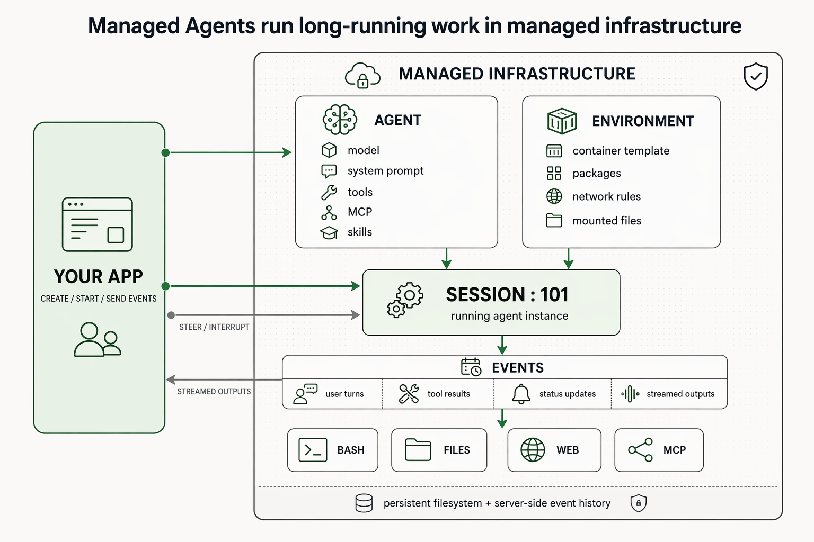
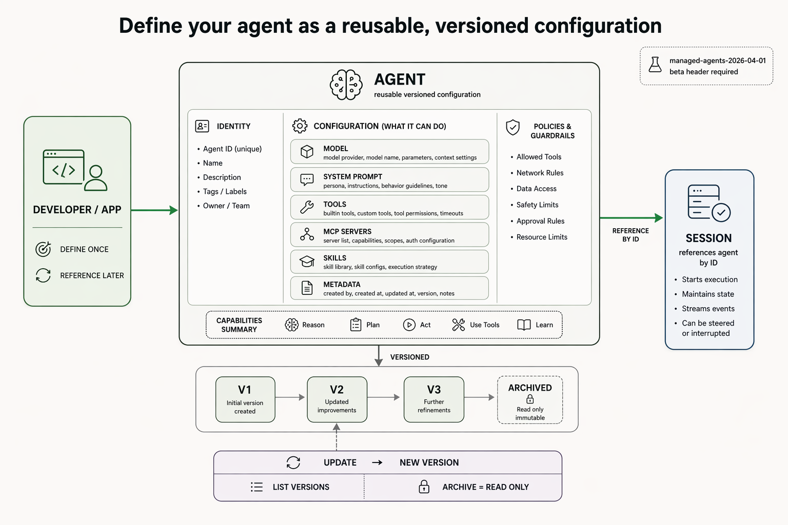
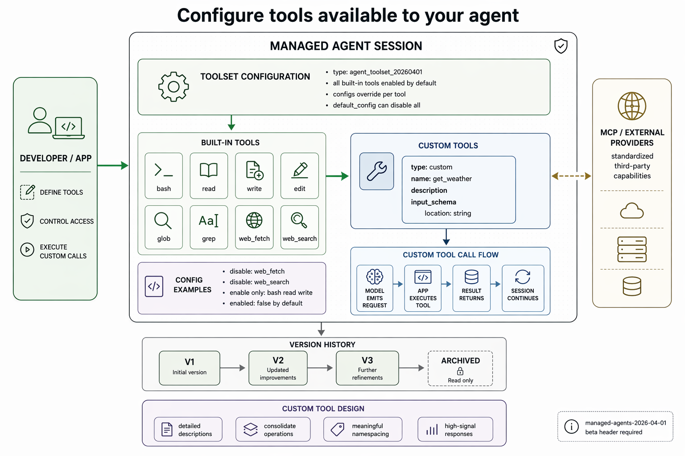
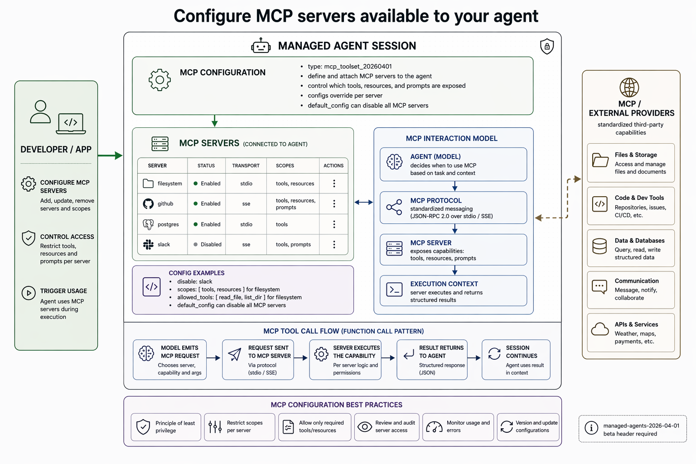
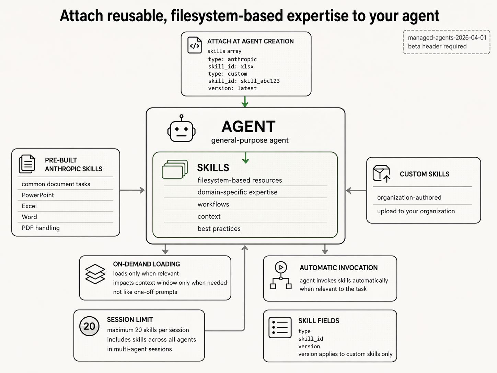
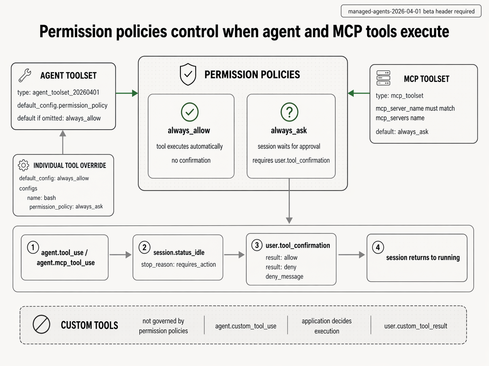
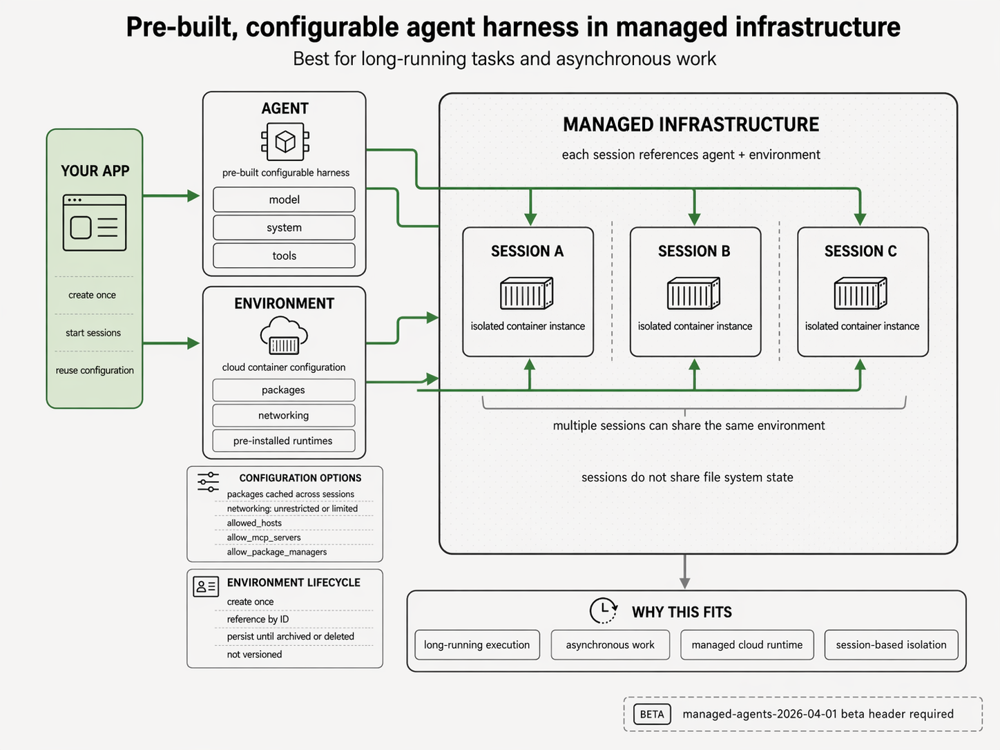
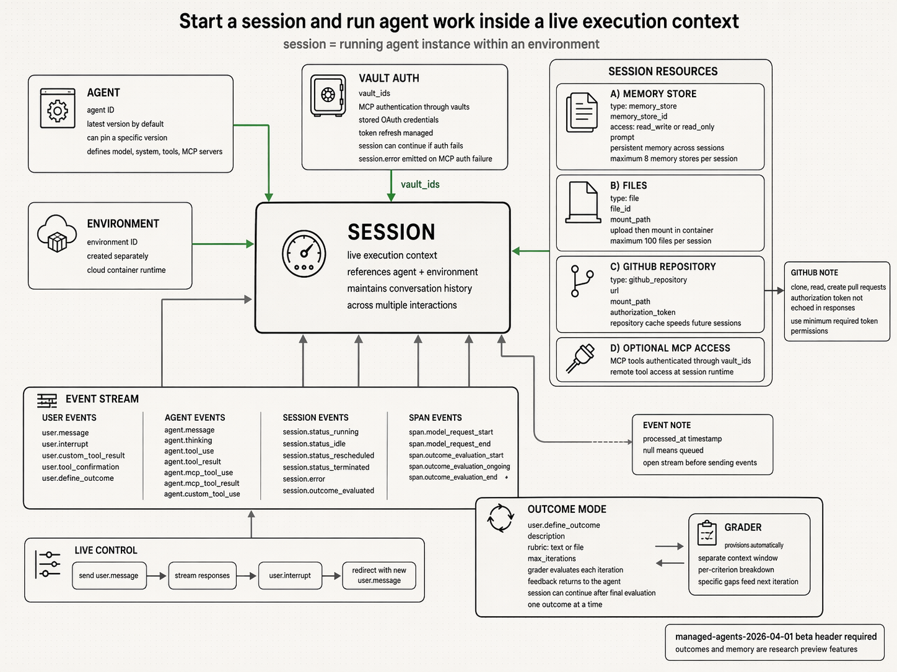
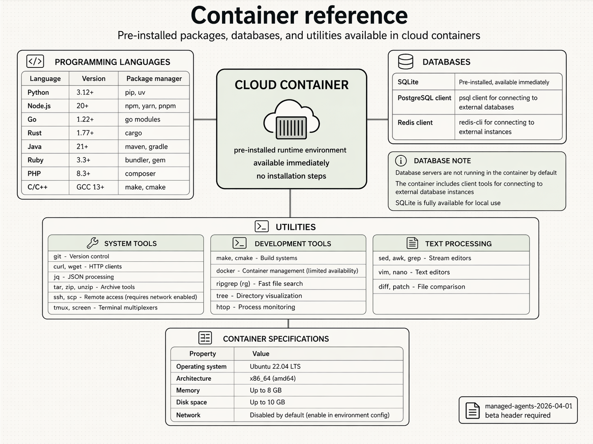

# Anthropic Managed Agents Architecture

## Architectural Claim
Anthropic's managed-agents design is a control-plane architecture in which a reusable, versioned $agent$ specification and a separately managed $environment$ are bound at session start; execution then proceeds as an event-driven runtime with explicit routing across built-in tools, custom tools, MCP servers, skills, permission gates, and cloud-container resources.

- Core configuration split:
  the source separates `AGENT` from `ENVIRONMENT`, then binds both into a live `SESSION`.
- Execution model:
  the runtime is represented through streamed events, session state transitions, and explicit tool or MCP call flows rather than a single synchronous request-response abstraction.
- Governance model:
  versioned agents, scoped MCP exposure, tool permission policies, and application-owned custom-tool execution define the main control boundaries.

## Causal System Overview

### Architecture
- Managed infrastructure contains two first-class configuration blocks:
  `AGENT` and `ENVIRONMENT`.
- The `AGENT` block explicitly includes:
  model, system prompt, tools, MCP, and skills.
- The `ENVIRONMENT` block explicitly includes:
  container template, packages, network rules, and mounted files.
- A running instance is represented as `SESSION : 101`.
- The event layer exposes four streamed classes:
  user turns, tool results, status updates, and streamed outputs.
- The runtime-facing capability surface shown beneath the event layer is:
  `BASH`, `FILES`, `WEB`, and `MCP`.
- The managed system persists:
  filesystem state and server-side event history.
- The application can:
  create, start, and send events to a session, steer or interrupt it, and receive streamed outputs.

### Mechanics
- The architecture splits static definition from live execution.
  The agent and environment are configuration assets; the session is the execution-time composition of those assets.
- The application does not directly invoke low-level tools.
  It interacts with the session boundary through event semantics.
- Persistent state is not limited to conversation text.
  The diagrams explicitly indicate persistent filesystem state plus server-side event history.

### Implications
- The design is not a "prompt wrapper" abstraction.
  It is a long-running agent runtime with explicit orchestration surfaces, persistent state, and multi-capability execution.

### Analytical State Equation

$$
S_t = (V, E, H, R, C, P)
$$

The figures justify each state component:
$V$ from versioned agent configuration,
$E$ from separate environment reference,
$H$ from streamed events plus server-side history,
$R_t$ from files, repositories, memory, and MCP access,
$C$ from tool, MCP, and custom-tool execution context,
and $P$ from explicit approval policies.

## Agent As A Reusable, Versioned Configuration

### Architecture
- The central claim in the source is:
  "Define your agent as a reusable, versioned configuration."
- Identity fields include:
  agent ID, name, description, tags or labels, and owner or team.
- Configuration fields include:
  model, system prompt, tools, MCP servers, skills, and metadata.
- Policies and guardrails include:
  allowed tools, network rules, data access, safety limits, approval rules, and resource limits.
- Capability summary includes:
  reason, plan, act, use tools, and learn.
- Sessions reference the agent by ID.
- Version lifecycle is shown as:
  `V1 -> V2 -> V3 -> Archived`.
- Lifecycle operations include:
  list versions, update to create a new version, and archive as read-only.
- The diagrams explicitly note:
  `managed-agents-2026-04-01 beta header required`.

### Mechanics
- The version boundary sits at the agent-definition layer rather than the session layer.
  This means sessions can pin or inherit a version while remaining operationally separate.
- Guardrails are part of the reusable configuration surface, not ad hoc runtime toggles.
- Versioning enables a stable reference model:
  developers define once, sessions instantiate later.

### Implications
- The agent object is a deployment artifact.
  It behaves closer to a versioned service specification than to a raw prompt template.

### Agent Lifecycle Equation

$$
A = (I, C, G, M, V)
$$

$$
A_{k+1} = U(A_k)
$$

## Tooling Plane: Built-In Tools And Custom Tools

### Architecture
- Toolset configuration type is shown as:
  `agent_toolset_20260401`.
- Built-in tools listed in the source are:
  `bash`, `read`, `write`, `edit`, `glob`, `grep`, `web_fetch`, and `web_search`.
- Built-in tool configuration can disable individual tools, and default configuration can disable all.
- Example configurations shown:
  disable `web_fetch`,
  disable `web_search`,
  enable only `bash read write`,
  tools `enabled: false by default`.
- Custom tools are defined by:
  `type`, `name`, `description`, and `input_schema`.
- The example custom tool is:
  `get_weather` with input schema `location: string`.
- Custom tool call flow is explicitly:
  model emits request -> app executes tool -> result returns -> session continues.
- Design guidance shown for custom tools:
  detailed descriptions, consolidate operations, meaningful namespacing, high-signal responses.
- MCP or external providers are presented as standardized third-party capabilities adjacent to tooling.

### Mechanics
- Built-in tools are runtime-native.
  Custom tools are app-mediated, meaning the application remains the executor for these calls.
- Tool discoverability is schema-driven.
  The model sees structured affordances, not only natural-language descriptions.
- High-signal tool responses are treated as an architectural requirement, implying that output quality affects downstream reasoning quality.

### Implications
- The tool model separates trusted local primitives from application-defined capability adapters.
  This is a deliberate control split: Anthropic owns the built-in runtime surface, while the app owns external execution semantics for custom tools.

### Capability Routing Equation

$$
r(q) = {B, T, M}
$$

Here $B$ denotes a built-in tool, $T$ a custom tool, and $M$ an MCP server. The diagrams do not place skills in this exact routing panel, but later figures show skills as a parallel expertise surface that influences how tasks are interpreted and executed.

## MCP Plane: Structured Access To External Capability Graphs

### Architecture
- MCP configuration type is shown as:
  `mcp_toolset_20260401`.
- The agent can define and attach MCP servers.
- Configuration can control which tools, resources, and prompts are exposed.
- Default configuration can disable all MCP servers.
- Example server table in the figure:

| Server | Status | Transport | Scopes |
|---|---|---|---|
| `filesystem` | Enabled | `stdio` | tools, resources |
| `github` | Enabled | `sse` | tools, resources, prompts |
| `postgres` | Enabled | `stdio` | tools |
| `slack` | Disabled | `sse` | tools, prompts |

- Example configuration lines shown in the source:
  disable `slack`,
  set filesystem scopes to `[tools, resources]`,
  allowed tools for filesystem: `[read_file, list_dir]`.
- MCP interaction model is explicitly decomposed into:
  agent decides when to use MCP,
  MCP protocol,
  MCP server,
  execution context.
- MCP protocol is explicitly labeled:
  `JSON-RPC 2.0 over stdio / SSE`.
- MCP tool call flow is explicitly:
  model emits MCP request -> request sent to MCP server via protocol -> server executes capability -> result returns to agent as structured JSON -> session continues.
- External-provider categories shown:
  files and storage,
  code and dev tools,
  data and databases,
  communication,
  APIs and services.
- Best-practice controls shown:
  principle of least privilege,
  restrict scopes per server,
  allow only required tools or resources,
  review and audit server access,
  monitor usage and errors,
  version and update configurations.

### Mechanics
- MCP is the extensibility layer for standardized remote capability access.
  It differs from custom tools by using a protocol-governed, server-mediated execution model.
- Scope control is first-class because MCP surfaces can expose more than callable tools.
  They can also expose resources and prompts.
- Transport choice matters operationally.
  `stdio` implies local or sidecar connectivity; `sse` implies stream-based remote connectivity.

### Implications
- Anthropic is treating MCP as a typed capability bus rather than a plugin label.
  The crucial design property is not server registration alone, but constrained exposure of tools, resources, and prompts under explicit protocol and scope boundaries.

### Structured Execution Equation

$$
R_m = F(Q, S, L, P)
$$

## Skills Plane: Reusable Filesystem-Based Expertise

### Architecture
- The source describes skills as reusable, filesystem-based expertise attached to an agent.
- Skills can be attached at agent creation through a `skills` array.
- Example fields shown:
  `type`, `skill_id`, and `version`.
- Version applies to custom skills only.
- The source explicitly distinguishes:
  pre-built Anthropic skills and custom skills.
- Pre-built examples listed:
  common document tasks, PowerPoint, Excel, Word, PDF handling.
- Custom skills are organization-authored and uploaded to the organization.
- Skills provide:
  filesystem-based resources,
  domain-specific expertise,
  workflows,
  context,
  best practices.
- Invocation behavior is shown as:
  on-demand loading and automatic invocation when relevant.
- A session limit is explicitly stated:
  maximum $20$ skills per session, including skills across all agents in multi-agent sessions.

### Mechanics
- Skills are not simple prompt snippets.
  They are packaged expertise bundles that can load resources and execution guidance only when needed.
- The on-demand load behavior is a context-window optimization strategy.
  Skills affect available expertise without forcing eager prompt inflation.
- Automatic invocation indicates relevance-driven activation rather than mandatory fixed inclusion during every turn.

### Implications
- Skills function as a retrieval-and-procedure layer that sits between static system prompting and dynamic tool execution.
  They are a mechanism for injecting structured expertise while preserving context efficiency.

### Skill Loading Constraint

$$
|K| <= 20
$$

The source makes this an operational hard limit, not a soft recommendation.

## Permission Policies And Approval Semantics

### Architecture
- The permission-policy figure explicitly controls when agent and MCP tools execute.
- Agent toolset example:
  `type: agent_toolset_20260401`,
  `default_config.permission_policy`,
  default if omitted:
  `always_allow`.
- Individual tool override example:
  default config `always_allow`,
  override `bash` to `always_ask`.
- MCP toolset example:
  `type: mcp_toolset`,
  server name must match MCP server name,
  default:
  `always_ask`.
- Two explicit permission modes exist:
  `always_allow` and `always_ask`.
- `always_allow`:
  tool executes automatically with no confirmation.
- `always_ask`:
  session waits for approval and requires `user.tool_confirmation`.
- The approval transition sequence is explicitly:
  `agent.tool_use / agent.mcp_tool_use`
  ->
  `session.status_idle` with stop reason `requires_action`
  ->
  `user.tool_confirmation`
  ->
  session returns to running.
- `user.tool_confirmation` results shown:
  allow, deny, deny message.
- The source explicitly states:
  custom tools are not governed by permission policies;
  `agent.custom_tool_use`,
  application decides execution,
  `user.custom_tool_result`.

### Mechanics
- Approval is implemented as a runtime state transition, not as a pre-execution static check.
- MCP access is stricter by default than agent built-in tools.
  The figure shows `always_ask` as the MCP default.
- Custom tools remain under application governance, which moves trust responsibility out of Anthropic's permission-policy layer.

### Implications
- Permission safety is asymmetric by design.
  Built-in tools and MCP calls have first-class policy objects, while custom tools rely on application-side control. This is a genuine integration risk boundary, not a documentation footnote.

### Permission Gate Equation

$$
g(a) = 1 if p(a)=p1 or (p(a)=p2 and c(a)=c1)
$$

Here $p1$ denotes the automatic-allow policy, $p2$ the ask-for-approval policy, and $c1$ an approval result.

## Environment Reuse And Session Isolation

### Architecture
- The source calls the environment a pre-built, configurable agent harness in managed infrastructure.
- It is positioned as best for:
  long-running tasks and asynchronous work.
- The app creates once, starts sessions, and reuses configuration.
- The `AGENT` block contains:
  model, system, tools.
- The `ENVIRONMENT` block contains:
  cloud container configuration, packages, networking, pre-installed runtimes.
- Configuration options shown:
  packages cached across sessions,
  networking unrestricted or limited,
  `allowed_hosts`,
  `allow_mcp_servers`,
  `allow_package_managers`.
- Environment lifecycle shown:
  create once,
  reference by ID,
  persist until archived or deleted,
  not versioned.
- Multiple sessions can share the same environment.
- Sessions do not share filesystem state.
- Claimed fit:
  long-running execution,
  asynchronous work,
  managed cloud runtime,
  session-based isolation.

### Mechanics
- The environment is durable infrastructure state, but per-session runtime state remains isolated.
- Reusing environment configuration improves setup amortization without collapsing session boundaries.
- Non-versioned environments create a different change-management model from versioned agents.
  This is a deliberate split: agent behavior history is tracked; environment lifecycle is durable but not versioned in the same way.

### Implications
- Anthropic separates behavioral reproducibility from runtime provisioning reuse.
  The agent is versioned for governance; the environment is reused for operational efficiency; the session is isolated for execution safety.

### Isolation Equation

$$
Xe = 1, Xf = 0
$$

This equation is a direct abstraction of the environment diagram's two strongest claims:
environment reuse across sessions and per-session filesystem isolation.

## Live Session Model: Resources, Events, Control, And Outcomes

### Architecture
- A session is defined as a running agent instance within an environment.
- The session references:
  agent and environment.
- The session maintains conversation history across multiple interactions.
- Agent fields shown:
  agent ID, latest version by default, optional pinned version, model/system/tools/MCP servers.
- Environment fields shown:
  environment ID, created separately, cloud container runtime.
- Vault authentication supports:
  `vault_ids`,
  MCP authentication through vaults,
  stored OAuth credentials,
  token refresh managed,
  session can continue if auth fails,
  `session.error` emitted on MCP auth failure.
- Session resources shown:

| Resource | Reported Fields |
|---|---|
| Memory store | `type: memory_store`, `memory_store_id`, access mode `read_write` or `read_only`, prompt, persistent memory across sessions, maximum $8$ memory stores per session |
| Files | `type: file`, `file_id`, `mount_path`, upload then mount in container, maximum $100$ files per session |
| GitHub repository | `type: github_repository`, `url`, `mount_path`, `authorization_token`, repository cache speeds future sessions |
| Optional MCP access | MCP tools authenticated through `vault_ids`, remote tool access at session runtime |

- GitHub note in the source:
  clone, read, and create pull requests;
  authorization token not echoed in responses;
  use minimum required token permissions.
- Event stream classes shown:
  user events,
  agent events,
  session events,
  span events.
- User events shown:
  `user.message`,
  `user.interrupt`,
  `user.custom_tool_result`,
  `user.tool_confirmation`,
  `user.define_outcome`.
- Agent events shown:
  `agent.message`,
  `agent.thinking`,
  `agent.tool_use`,
  `agent.tool_result`,
  `agent.mcp_tool_use`,
  `agent.mcp_tool_result`,
  `agent.custom_tool_use`.
- Session events shown:
  `session.status_running`,
  `session.status_idle`,
  `session.status_rescheduled`,
  `session.status_terminated`,
  `session.error`,
  `session.outcome_evaluated`.
- Span events shown:
  `span.model_request_start`,
  `span.model_request_end`,
  `span.outcome_evaluation_start`,
  `span.outcome_evaluation_ongoing`,
  `span.outcome_evaluation_end`.
- Event note:
  `processed_at` timestamp,
  `null` means queued,
  open stream before sending events.
- Live-control loop shown:
  send `user.message`
  ->
  stream responses
  ->
  `user.interrupt`
  ->
  redirect with new `user.message`.
- Outcome mode fields shown:
  `user.define_outcome`,
  description,
  rubric as text or file,
  `max_iterations`,
  grader evaluates each iteration,
  feedback returns to the agent,
  session can continue after final evaluation,
  one outcome at a time.
- Grader behavior shown:
  provisions automatically,
  separate context window,
  per-criterion breakdown,
  specific gaps feed next iteration.
- The figure notes:
  `managed-agents-2026-04-01 beta header required`,
  outcomes and memory are research preview features.

### Mechanics
- The session is a fully observable orchestration loop rather than a black-box chat turn processor.
- Event taxonomy is designed for external supervision and replayability.
- Outcome mode adds a self-evaluation loop with bounded iteration count and criterion-specific feedback.
- Memory stores and repositories extend state beyond ephemeral conversation while preserving explicit attachment semantics.

### Implications
- The session abstraction is the real operating system boundary of the platform.
  It binds agent definition, environment, resources, vault-authenticated access, event telemetry, and iterative outcome evaluation into one managed control loop.

### Session Transition Relation

$$
u -> a -> (t or m or c) -> r -> s
$$

Here $u$ denotes a user message, $a$ an agent response, $t$ a built-in tool call, $m$ an MCP call, $c$ a custom-tool call, $r$ a returned result, and $s$ a session-status update.

## Container Reference: Runtime Envelope And Operational Limits

### Architecture
- The container is described as a pre-installed runtime environment available immediately with no installation steps.
- Programming languages and package managers shown:

| Language | Version | Package Manager |
|---|---:|---|
| Python | `3.12+` | `pip`, `uv` |
| Node.js | `20+` | `npm`, `yarn`, `pnpm` |
| Go | `1.22+` | `go modules` |
| Rust | `1.77+` | `cargo` |
| Java | `21+` | `maven`, `gradle` |
| Ruby | `3.3+` | `bundler`, `gem` |
| PHP | `8.3+` | `composer` |
| C/C++ | `GCC 13+` | `make`, `cmake` |

- Databases shown:
  SQLite pre-installed and available immediately,
  PostgreSQL client for connecting to external databases,
  Redis client for connecting to external instances.
- Database note in the source:
  database servers are not running in the container by default,
  the container includes client tools for connecting to external databases,
  SQLite is fully available for local use.
- Utility categories shown:

| Category | Tools |
|---|---|
| System tools | `git`, `curl`, `wget`, `jq`, `tar`, `zip`, `unzip`, `ssh`, `scp`, `tmux`, `screen` |
| Development tools | `make`, `cmake`, `docker` with limited availability, `ripgrep (rg)`, `tree`, `htop` |
| Text processing | `sed`, `awk`, `grep`, `vim`, `nano`, `diff`, `patch` |

- Container specifications shown:

| Property | Value |
|---|---|
| Operating system | `Ubuntu 22.04 LTS` |
| Architecture | `x86_64 (amd64)` |
| Memory | up to `8 GB` |
| Disk space | up to `10 GB` |
| Network | disabled by default, enable in environment config |

- The figure again notes:
  `managed-agents-2026-04-01 beta header required`.

### Mechanics
- The runtime is optimized for immediate execution rather than custom image build pipelines.
- Local embedded storage is intentionally narrow.
  SQLite is first-class local state; networked databases require external services plus enabled network policy.
- The presence of multiple language runtimes suggests environment reuse is meant to cover heterogeneous tool chains without custom bootstrapping.

### Implications
- The container envelope is generous enough for general automation and light build/test workflows, but it is not presented as an unrestricted long-lived VM.
  Network is opt-in, local database service is minimal, and disk/memory ceilings are explicit.

## Cross-Component Dependency Map

| Layer | Direct Inputs | Emits Or Exposes | Governing Controls | Persistence Model | Operational Risk |
|---|---|---|---|---|---|
| Agent | identity, model, system prompt, tools, MCP servers, skills, metadata | reusable versioned configuration | policies, guardrails, versioning | version history until archived | config drift across versions if pinning is inconsistent |
| Environment | packages, networking, mounted files, runtime config | reusable cloud execution substrate | allowed hosts, MCP servers, package managers | durable by ID, not versioned | hidden reproducibility risk if environment changes without version semantics |
| Session | agent reference, environment reference, attached resources, vault bindings | live execution context and event stream | permission policies, user confirmations, live control | server-side event history plus resource-specific persistence | execution-state complexity, approval stalls, auth failure modes |
| Built-in tools | toolset config | native runtime actions | tool-specific permission policy | reflected through session history | unsafe defaults if `always_allow` is too broad |
| Custom tools | model request, app executor | app-returned results | application-side governance | app-dependent | weakest trust boundary because policy layer does not govern execution |
| MCP servers | protocol request, scopes, server logic | structured tools/resources/prompts | server scopes, permissions, audits | server-dependent | over-exposure of prompts/resources, remote execution surface |
| Skills | skill array, filesystem resources | on-demand expertise injection | session skill limit, skill metadata | attached at agent level | context misfire or low-signal skill packaging |

## Bottleneck And Trade-Off Matrix

| Design Choice | Benefit | Cost | Hidden Assumption | Failure Mode |
|---|---|---|---|---|
| Versioned agent, non-versioned environment | governance for behavior, reuse for runtime | split lifecycle management | environment changes remain operationally compatible | reproducibility gap between session runs |
| Event-driven session interface | observability, control, interruption | higher orchestration complexity | clients can manage stream ordering and idle states | stalled automation if event consumer is poorly implemented |
| MCP as typed protocol layer | standardized external capability access | transport/scoping complexity | server operators expose minimal necessary surfaces | prompt/resource overexposure or remote-call fragility |
| Custom tools executed by app | app-specific freedom | external trust boundary | application enforces its own safety checks | policy bypass relative to tool/MCP controls |
| On-demand skill loading | context efficiency | relevance-detection dependency | model or orchestration selects the correct skill | under-activation or wrong-skill activation |
| Shared environment across isolated sessions | setup amortization | lifecycle divergence from agent versions | cached packages and config remain safe across workloads | cross-run expectation mismatch despite filesystem isolation |

## Practitioner Pseudo-Algorithm

### Managed Session Lifecycle
1. Resolve $agent\_id$ to the latest or pinned versioned agent definition.
2. Resolve $environment\_id$ to the managed cloud container configuration.
3. Materialize session runtime from:
   agent configuration,
   environment configuration,
   attached files or repositories,
   vault-backed credentials,
   enabled tool and MCP surfaces,
   relevant skills.
4. Open the event stream before sending user events.
5. Send `user.message`.
6. Consume streamed agent, session, and span events until one of the following occurs:
   tool request,
   MCP request,
   custom tool request,
   outcome-evaluation transition,
   termination,
   idle state requiring action.
7. If permission policy is `always_ask`, wait for `user.tool_confirmation` and branch on allow or deny.
8. If execution target is:
   built-in tool,
   run within the managed runtime;
   MCP server,
   send JSON-RPC request through configured transport;
   custom tool,
   let the application execute and return `user.custom_tool_result`.
9. Append results to session history and continue the loop until completion or interruption.
10. If `user.define_outcome` is active, iterate grader feedback until reaching the rubric condition or `max_iterations`.

## Practitioner Conclusions

### Adopt
- Reusable versioned agent definitions for behavioral governance.
- Separate environment objects for long-running and asynchronous workloads.
- Explicit event streaming as the integration contract.
- Least-privilege MCP scoping and audit discipline.
- On-demand skills as a context-efficiency mechanism.

### Re-Test
- The reproducibility impact of non-versioned environments.
- The safety posture of `always_allow` defaults for built-in tools.
- Custom-tool trust boundaries because the permission-policy system does not govern them.
- Outcome-mode and memory-store behavior because the source marks them as research preview features.

### Ignore
- Any interpretation that reduces the system to "prompt plus tools."
  The source material repeatedly shows a broader control-plane model with explicit versioning, environment reuse, event semantics, and governed execution pathways.

### Re-Engineer In Production If Needed
- Add stronger application-side policy enforcement for custom tools.
- Add explicit environment change tracking if reproducibility matters.
- Add stream-ordering, retry, and approval-handling logic in the client because the diagrams assume the application can correctly manage live event flow and idle transitions.
